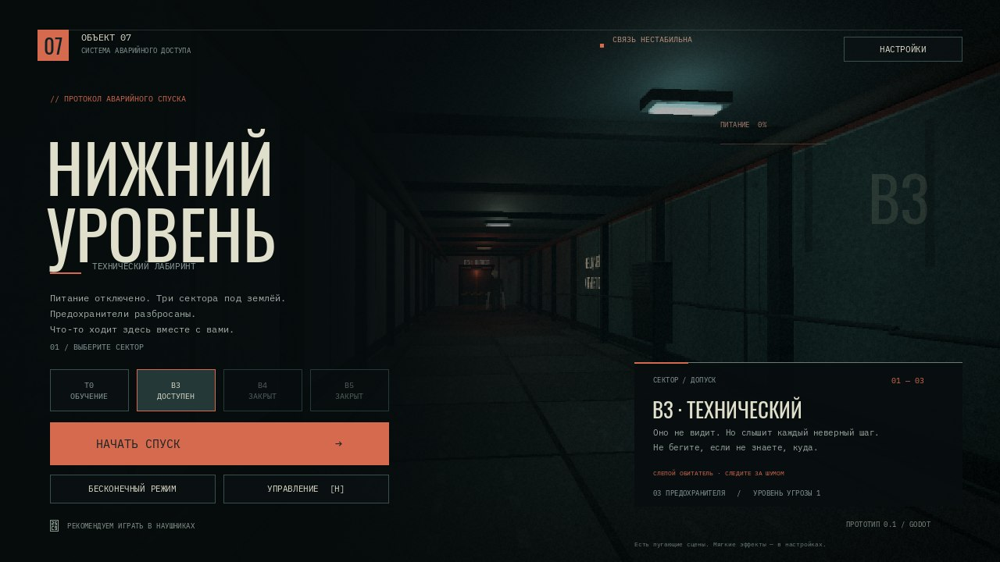

# НИЖНИЙ УРОВЕНЬ

**Объект 07 · редактируемый хоррор-прототип на Godot 4.5+**

Питание отключено. Найдите предохранители в промышленном лабиринте, восстановите аварийный шлюз и спускайтесь дальше. Обитатель слышит ваши шаги. Не бегите без необходимости.

Это полноценный **3D-проект Godot на GDScript**, вдохновлённый предоставленным примером: не HTML-рейкастер и не JavaScript-имитация движка. Модели, лабиринт, интерфейс, звук и игровой цикл работают внутри Godot. Веб-страница предпросмотра только запускает его WebAssembly-сборку.



## Быстрый запуск

1. Установите обычную версию **Godot 4.6** (рекомендуется; C#/.NET не нужен). Проект использует API Godot 4.5+.
2. Распакуйте исходники в отдельную папку. В менеджере проектов выберите **Импорт → `project.godot`**.
3. Дождитесь открытия редактора и нажмите **F5**. Главная сцена — `scenes/main.tscn`.
4. Для первого знакомства выберите **T0 / обучение**. Сектор B3 доступен сразу.

Никаких плагинов, Blender, npm, Python или скачивания ассетов для игры не требуется. Рендерер — **Compatibility**. Для игры в браузере нужен WebGL 2; предпочтительны компьютер, мышь и наушники.

## Что реализовано

- От первого лица: ходьба, ускоренный спринт **5,8 м/с** (примерно на 25% быстрее), выносливость, приседание, мышь и клавиатура. Полного запаса хватает примерно на 3,6 секунды бега; после истощения нужно восстановить заряд.
- Генерируемые по seed связные лабиринты; предохранители, запасные батареи, аварийный шлюз, лифт.
- Фонарь с расходуемым зарядом. Запасная батарея автоматически заменяет разряженную.
- Прицельный шокер: ограниченные заряды, проверка дальности и препятствий, оглушение на **6 секунд**. Перезарядка тратит **одну общую запасную батарею**.
- Три бросаемых камня: шум возникает там, где камень приземлился.
- Шум шагов зависит от темпа: базовая дальность — 1,6 м в приседе, 9 м при ходьбе и 26 м при беге; тип обитателя и путь звука по коридорам дополнительно влияют на обнаружение.
- Обитатель патрулирует, исследует звуки, ищет и преследует последнюю известную позицию. Он не получает координаты игрока через стены. На B3 он слепой; глубже появляются типы со зрением.
- Карта открывает исследованные участки. Компас помогает на ранних уровнях; на B5 его нет.
- Разрушаемые шумные перегородки в глубоких секторах.
- Русские меню, пауза, настройки яркости/звука/чувствительности, поимка со скримером, повтор, результаты.
- Сохранение открытых секторов, лучших времён и рекорда бесконечного режима.
- Процедурные текстуры, низкополигональные модели, пространственные звуки, ретро-обработка ниже чёткого интерфейса.
- Базовое сенсорное управление: стик слева, обзор свободным пальцем, экранные кнопки справа. Рекомендуется горизонтальная ориентация; на физических телефонах производительность ещё не проверялась.

### Секторы

| Сектор | Лабиринт | Предохранители | Особенность |
| --- | --- | --- | --- |
| T0 | 9 × 9 | 2 | Безопасное обучение, без монстра |
| B3 | 17 × 17 | 3 | Слепой обитатель, ориентируется на шум |
| B4 | 21 × 21 | 4 | Зрение, шумные обходные проходы |
| B5 | 25 × 25 | 5 | Усиленный слух, без компаса |
| ∞ | До 29 × 29 | До 7 | Автоматический переход между этажами, ограниченный рост сложности |

B3 открывает B4; B4 открывает B5. Обучение не обязательно. Бесконечный режим доступен из меню. Повтор после смерти в кампании сохраняет расположение лабиринта; новый запуск из меню даёт новый seed.

## Управление

| Клавиша | Действие |
| --- | --- |
| WASD | Движение; работают физические клавиши и при русской раскладке |
| Мышь | Обзор |
| ↑ / ↓, ← / → | Вперёд/назад, поворот без мыши |
| Shift | Бег, пока хватает выносливости |
| C | Присесть / встать |
| F | Фонарь |
| E | Взять предмет, открыть шлюз, сломать хрупкую перегородку |
| Пробел / ЛКМ | Шокер |
| R | Зарядить один потраченный слот шокера |
| Q | Бросить камень |
| M | Карта |
| Esc | Пауза / продолжить; закрыть настройки меню |
| H | Памятка в главном меню |
| F11 | Полный экран в настольной версии |

Если браузер освободил указатель, нажмите «Продолжить» и щёлкните по игре. Потеря фокуса ставит игру на паузу. На сенсорном экране кнопка «БЕГ» удерживается; «ТИШЕ» переключает приседание.

**Совет:** не тратьте последнюю запасную батарею на шокер, если фонарь почти разряжен. Бег слышен на несколько коридоров дальше обычного шага; тихая ходьба и приседание помогут не выдать себя. Камень лучше бросать в соседний коридор, а не себе под ноги.

Есть пугающие сцены и резкие звуки. В настройках доступны **«Мягкие эффекты»**: без зерна, покачивания и мерцания фонаря. Этот режим не удаляет монстра и сцену поимки.

## Редактирование

| Файл | Что менять |
| --- | --- |
| `scripts/level_config.gd` | Размеры, скорость монстров, ресурсы, сложность |
| `scripts/maze.gd` | Генерация, размещение предметов, поиск пути |
| `scripts/world.gd` | Геометрия, свет, взаимодействия, исследование карты |
| `scripts/player.gd`, `scenes/player.tscn` | Движение, камера, фонарь, шокер |
| `scripts/creature.gd`, `scenes/creature.tscn` | Слух, зрение, поиск и преследование |
| `scripts/main.gd` | Игровые состояния, обучение, прогрессия, лифт |
| `scripts/interface.gd`, `scripts/hud.gd` | Нативные меню и HUD |
| `scripts/touch_controls.gd` | Мультитач и экранные кнопки |
| `scripts/models.gd` | Процедурные модели и материалы |
| `shaders/retro.gdshader` | Пикселизация, зерно, виньетка |
| `scripts/audio.gd`, `assets/audio/` | Микшер и звуки |
| `scripts/progress.gd` | Сохранения и настройки |

Лабиринт и большинство моделей создаются **при запуске**: в пустой сцене редактора нет вручную расставленного уровня. Чтобы повторить конкретный лабиринт из кода, вызовите `start_run(1, 0, 901)` — B3 с seed 901.

Исходные PNG, WAV и TTF загружаются явно. Соседние файлы **`*.import` с `importer="keep"` нужны для экспорта**: не заменяйте их обычным импортом текстур/звуков, иначе экспортёр может убрать исходные файлы из PCK. При добавлении нового такого ассета выберите **Import → Keep File** и включите его путь в фильтры экспорта.

### Сохранения

`user://lower_level.cfg` хранит настройки, открытия и рекорды, но **не текущую позицию в забеге**. Папку можно открыть из редактора: **Project → Open User Data Folder**. Удаление этого файла сбрасывает прогресс. В браузере данные принадлежат конкретному адресу сайта и хранятся в IndexedDB; приватный режим или очистка данных сайта могут их удалить.

## Экспорт

В `export_presets.cfg` подготовлены нативные пресеты **Windows Desktop**, **Linux**, **Web**. Установите шаблоны экспорта **той же версии**, что и редактор: Editor → Manage Export Templates. Затем Project → Export → нужный пресет → Export Project. Нативный Windows-экспорт создаётся только этим путём; готовых нативных Windows-файлов в исходном ZIP нет.

Через терминал (замените `godot` именем установленного бинарника):

```sh
mkdir -p dist/windows dist/linux .web
godot --headless --path . --editor --import
godot --headless --path . --export-release "Windows Desktop" dist/windows/lower-level.exe
godot --headless --path . --export-release "Linux" dist/linux/lower-level.x86_64
godot --headless --path . --export-release "Web" .web/index.html
```

Веб-сборку нельзя запускать двойным щелчком через `file://`. Используйте HTTP:

```sh
python3 tools/serve_preview.py --port 8080
```

Затем откройте `http://localhost:8080`. Сервер слушает `0.0.0.0`, отдаёт MIME-тип WebAssembly и заголовки COOP/COEP. На публичном хостинге используйте HTTPS. Пресет Web однопоточный, без GDExtension.

Официальный экспорт использует стандартную HTML-оболочку Godot. `tools/web_shell.html` и `tools/pack_preview.py` — вспомогательные средства предпросмотра в среде без установленного редактора; они не заменяют обычный экспорт проекта.

### Однофайловый Windows-лаунчер

В `Нижний уровень.exe` входят Windows-сборка Node.js, проверенный WebAssembly-файл движка и PCK игры. Он запускает небольшой сервер **только на этом компьютере** (`127.0.0.1`) и открывает браузер с игрой; файлы игры полностью встроены, так что при запуске доступ в Интернет не требуется. Это удобная оболочка для игры, а не полноценная Windows-сборка рендерера Godot. [Скачать обновлённый архив лаунчера](https://github.com/Nornity/-/blob/arena/01a0e7e9-repo/downloads/lower-level-windows.zip?raw=1).

Пересобрать лаунчер можно при наличии Python 3, Node.js **v22.22.3**, npm и подключения к npm registry:

```sh
python3 tools/pack_preview.py --template /путь/к/веб-шаблону-Godot-4.6
python3 tools/build_windows_exe.py --output "dist/windows/Нижний уровень.exe"
```

Скрипт фиксирует SHA-512 скачанного Windows Node.js runtime, создаёт single-executable blob и объединяет его с игрой. Отдельно распространяемый `.exe` открывает по умолчанию зарегистрированный в Windows браузер с поддержкой WebGL 2. Исходники игры и применимые лицензионные уведомления входят в проект.

## Проверки

В `tests/smoke.gd` — проверки, исполняемые **самим Godot**: 64 детерминированных лабиринта, связность и доступность ресурсов, движение/коллизии, плавное преследование на перекрёстках без привязки к центрам клеток, скример при поимке, пауза, расход заряда, оглушение/видимость/слух, карта, сенсорные действия, перезапуск, победа, бесконечные этажи, сохранение/загрузка. На время проверки отключается только 3D-рендер, а не физика.

```sh
godot --headless --path . -- --smoke-test
```

Нативный запуск возвращает код 0 при успехе и ненулевой код при ошибке. Проверка восстанавливает исходный файл сохранения. Параметр предназначен для проекта с исходниками, не для релизных экспортов, из которых тесты исключены.

Результат последнего прогона, среда и ограничения: **[docs/TESTING.md](docs/TESTING.md)**.

Для проверки текущего вспомогательного веб-предпросмотра:

```sh
python3 -m pip install playwright
python3 -m playwright install chromium
python3 tools/pack_preview.py --template /путь/к/совместимому/веб/шаблону
python3 tools/serve_preview.py --port 8080
# В другом терминале:
python3 tools/browser_check.py --test
python3 tools/browser_check.py --play
```

Каталог шаблона должен содержать `index.js`, `index.wasm` и соответствующие audio worklet-файлы из одной версии Godot 4.5+. При `?test=1` вспомогательная оболочка использует непостоянную файловую систему, изолированную от пользовательских сохранений сайта. Скрипт проверяет сообщения консоли, результат тестов и сохраняет скриншот в `artifacts/`. `CHROMIUM_PATH` позволяет указать установленный Chromium.

### Вспомогательные инструменты

```sh
# Пересоздать оригинальные текстуры и звуки (для игры это не нужно):
python3 -m pip install numpy pillow
python3 tools/generate_assets.py

# Собрать небольшой ZIP с редактируемыми исходниками:
python3 tools/package_source.py
```

## Статус прототипа

Это играбельная основа, **не готовый коммерческий релиз и не точная копия всех деталей референса**. Нет сетевого режима, озвученного сюжета, поддержки геймпада или сохранения посреди забега. Баланс и производительность на разных устройствах требуют дальнейших игровых тестов. Нативные настольные бинарники не включены в исходный архив; их можно собрать из проекта.

Шрифты и лицензии: **[CREDITS.md](CREDITS.md)**. Новые исходники и оригинальные процедурные ассеты — MIT, сторонние шрифты — SIL OFL 1.1.
